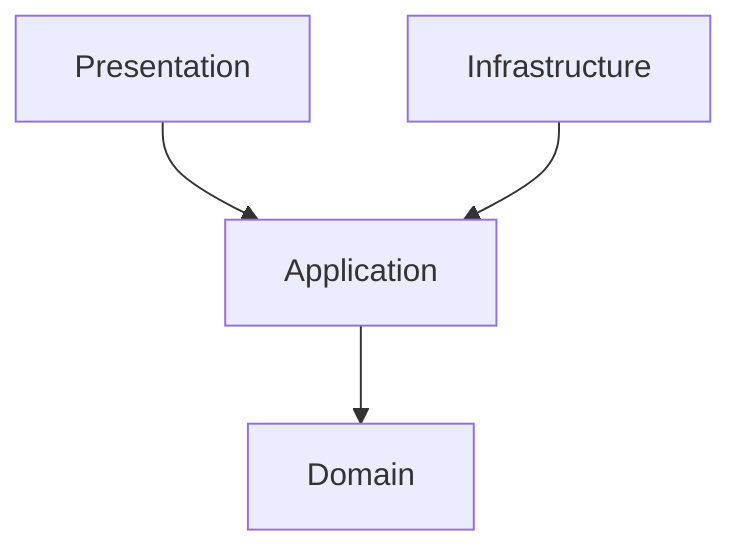

# Kiến trúc Clean Architecture

Dự án này áp dụng mô hình Clean Architecture để phân tách các mối quan tâm (separation of concerns), giúp mã nguồn dễ bảo trì, dễ kiểm thử và độc lập với Framework, Database cũng như giao diện.

## Nguyên tắc cốt lõi (Dependency Rule)

Luồng phụ thuộc của mã nguồn (Source Code Dependencies) **chỉ được phép hướng vào trong** (về phía các tầng cốt lõi).

- **Lớp bên trong không được biết bất cứ thông tin gì về lớp bên ngoài.**
- Khi lớp bên trong cần giao tiếp với lớp bên ngoài (ví dụ: Application gọi Database), chúng ta sử dụng nguyên lý đảo ngược phụ thuộc (Dependency Inversion) bằng cách định nghĩa các Interface (Ports) ở lớp bên trong, và lớp bên ngoài sẽ implement các Interface đó.

## Mục tiêu
- Độc lập với Framework: Không bị ràng buộc bởi thư viện, có thể thay thế khi cần.
- Dễ dàng Test: Có thể test Domain logic, Application logic mà không cần DB hay Web server.
- Độc lập UI và DB: Chuyển từ PostgreSQL sang MySQL hay từ Web sang CLI đều không ảnh hưởng lõi hệ thống.

## Tham khảo thêm
- **[Giải thích cấu trúc các tầng (Layers Explanation)](layers-explanation.md)**: Chứa ví dụ thực tế về các class hiện có trong codebase của từng tầng.
- **[Tính năng hiện có (Existing Features)](existing-features.md)**: Danh sách các tính năng Backend đã thực hiện.
- **[Code Wiki](../../../.code-review-graph/wiki/index.md)**: Tài liệu được sinh tự động bởi `code-review-graph` bằng cách phân tích luồng code (Flow) thực tế trong hệ thống.
